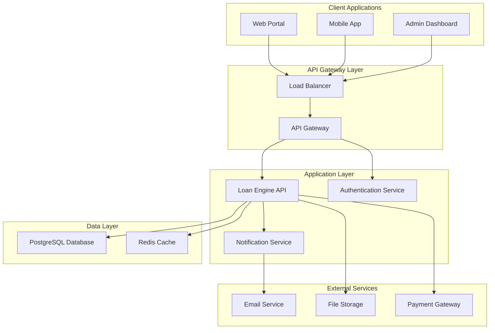
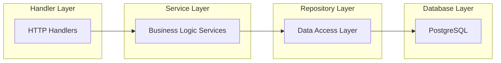

# Loan Engine - Technical Architecture Document

## Table of Contents
1. [Overview](#overview)
2. [System Architecture](#system-architecture)
3. [Technology Stack](#technology-stack)
4. [Database Design](#database-design)
5. [API Design](#api-design)
6. [Service Layer](#service-layer)
7. [Repository Pattern](#repository-pattern)
8. [External Services & Mocking](#external-services--mocking)
9. [Deployment Architecture](#deployment-architecture)
10. [Security Considerations](#security-considerations)
11. [Performance & Scalability](#performance--scalability)
12. [Monitoring & Logging](#monitoring--logging)

## Overview

The Loan Engine is a RESTful API system designed to manage the complete lifecycle of loans from proposal to disbursement. The system supports multiple loan states (proposed, approved, invested, disbursed) with strict business rules governing state transitions.

### Key Features
- Loan lifecycle management with state transitions
- Investor management and investment tracking
- Approval workflow with validation requirements
- Disbursement management with documentation
- Investor notifications via email
- Comprehensive audit trail

## System Architecture

### High-Level Architecture


### Component Architecture


## Technology Stack

### Backend
- **Language**: Go (Golang) 1.21+
- **Web Framework**: Chi router for HTTP routing
- **Database**: PostgreSQL 15+
- **Database Library**: SQLX for database operations
- **Authentication**: JWT tokens
- **Testing**: Go's built-in testing framework + testify

### Infrastructure
- **Containerization**: Docker & Docker Compose
- **Caching**: Redis
- **Database Management**: Adminer (for development)

### External Services (Mocked)
- **Email Service**: SMTP or third-party provider
- **File Storage**: Local or cloud storage (S3)

## Database Design

### Core Entities
The database schema consists of 8 main tables:

1. **borrowers** - Stores borrower information
2. **loans** - Main loan entity with state tracking
3. **loan_approvals** - Approval information and documentation
4. **loan_disbursements** - Disbursement information and documentation
5. **investors** - Investor information
6. **loan_investments** - Tracks individual investments in loans
7. **loan_state_history** - Audit trail of state transitions
8. **users** - Authentication and authorization

### Key Constraints
- State transitions are enforced through database triggers
- Investment amounts are validated against remaining principal
- Unique constraints prevent duplicate investments
- Foreign key relationships maintain data integrity

## API Design

### RESTful Endpoints

#### Loan Management
- `POST /api/v1/loans` - Create new loan (initial state: proposed)
- `GET /api/v1/loans/{id}` - Get loan details
- `GET /api/v1/loans?state={state}&page={page}&limit={limit}` - List loans with filtering
- `POST /api/v1/loans/{id}/approve` - Approve loan
- `POST /api/v1/loans/{id}/invest` - Invest in loan
- `POST /api/v1/loans/{id}/disburse` - Disburse loan

#### Investor Management
- `POST /api/v1/investors` - Create investor
- `GET /api/v1/investors/{id}` - Get investor details
- `GET /api/v1/investors/{id}/investments` - Get investor's investments

#### Borrower Management
- `POST /api/v1/borrowers` - Create borrower
- `GET /api/v1/borrowers/{id}` - Get borrower details

#### Authentication
- `POST /api/v1/auth/register` - User registration
- `POST /api/v1/auth/login` - User login
- `POST /api/v1/auth/refresh` - Token refresh

### Response Format
```json
{
  "success": true,
  "data": {},
  "message": "Success message"
}
```

## Service Layer

### Architecture Pattern
The service layer implements business logic using a clean architecture approach with clear separation of concerns:

1. **Handler Layer**: HTTP request/response handling
2. **Service Layer**: Business logic and orchestration
3. **Repository Layer**: Data access operations
4. **External Services**: Integration with third-party services

### Key Services
- **LoanService**: Manages loan lifecycle and state transitions
- **InvestmentService**: Handles investment operations
- **ApprovalService**: Manages loan approval process
- **DisbursementService**: Handles loan disbursement
- **AuthService**: Authentication and authorization

### Business Rules Enforcement
- State transition validation (forward-only transitions)
- Investment amount validation against remaining principal
- Duplicate investment prevention
- Approval and disbursement requirement validation

## Repository Pattern

### Interface Design
Each repository follows a consistent interface pattern:

```go
type LoanRepository interface {
    Create(ctx context.Context, loan *models.Loan) error
    GetByID(ctx context.Context, id int) (*models.Loan, error)
    Update(ctx context.Context, loan *models.Loan) error
    Delete(ctx context.Context, id int) error
    List(ctx context.Context, state *string, offset, limit int) ([]*models.Loan, error)
}
```

### Implementation Benefits
- **Testability**: Easy to mock for unit testing
- **Maintainability**: Clear separation of data access logic
- **Flexibility**: Easy to switch database implementations
- **Consistency**: Standardized data access patterns

### Transaction Management
Critical operations use database transactions to ensure data consistency:
- Loan approval with state transition
- Investment with total amount update
- Disbursement with state transition

## External Services & Mocking

### Service Abstraction
All external services are abstracted through interfaces:

```go
type EmailService interface {
    SendInvestmentConfirmation(ctx context.Context, toEmail, agreementLink, loanDetails string) error
}

type StorageService interface {
    UploadFile(ctx context.Context, file io.Reader, fileName, contentType string) (string, error)
}
```

### Mocking Strategy
- **Development**: Mock services for fast iteration
- **Testing**: Mock services for isolated unit tests
- **Production**: Real services with proper error handling
- **Configuration**: Environment-based service selection

### Mock Services Benefits
- Fast test execution
- Predictable test results
- No external dependencies during development
- Cost reduction in development environments

## Deployment Architecture

### Docker Compose Setup
The system is containerized with the following services:
- **PostgreSQL**: Primary database
- **Redis**: Caching and session storage
- **Loan Engine API**: Main application
- **Adminer**: Database management tool (dev only)

### Environment Configuration
- **Development**: Mock services, debug logging
- **Staging**: Real services with monitoring
- **Production**: Optimized configuration, security hardening

### Health Checks
- Database connectivity
- API endpoint availability
- External service availability

## Security Considerations

### Authentication & Authorization
- JWT-based authentication
- Role-based access control (admin, staff, investor)
- Secure password hashing (bcrypt)
- Token expiration and refresh

### Data Protection
- Input validation and sanitization
- SQL injection prevention (parameterized queries)
- File upload validation
- Rate limiting for API endpoints

### API Security
- HTTPS enforcement
- CORS configuration
- Request size limits
- Authentication for sensitive endpoints

## Performance & Scalability

### Database Optimization
- Proper indexing strategy
- Query optimization
- Connection pooling
- Read replicas for reporting

### Caching Strategy
- Redis for session storage
- API response caching
- Frequently accessed data caching

### Horizontal Scaling
- Stateless application design
- Load balancer support
- Database connection management
- Distributed caching

## Monitoring & Logging

### Logging Strategy
- Structured logging with JSON format
- Different log levels for different environments
- Request/response logging for debugging
- Audit logging for state transitions

### Metrics & Monitoring
- API response times
- Error rates
- Database connection pool metrics
- Business metrics (loan states, investment amounts)

### Health Checks
- Database connectivity
- External service availability
- Application health endpoints
- Resource utilization monitoring